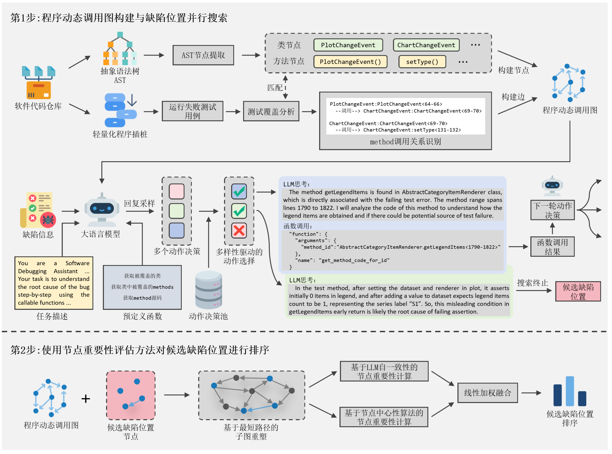

# 仓库介绍

本仓库为论文 **《基于并行搜索和节点重要性评估的大模型缺陷定位增强方法》**的官方仓库.
本文提出了一种基于并行搜索和节点重要性评估的大模型缺陷定位增强方法PRIME。为解决现有方法决策路径单一的问题，PRIME将缺陷定位任务定义为一个搜索问题，通过在每一推理步骤对LLM的回答进行多次采样和多样性驱动的动作选择，PRIME支持将单一搜索路径拓展为可以并行推理的多条搜索路径，旨在增大LLM寻找到错误代码位置的成功率。然而，更多的搜索路径意味着定位方法将输出更多的可疑代码位置，这可能会为开发人员确认真实的错误位置带来额外的工作量。为此，PRIME进一步引入了基于节点重要性评估的定位结果优化算法。具体而言，PRIME首先将定位结果中的每个可疑代码位置映射到方法调用图的单个节点，通过子图提取重塑节点之间的拓扑结构；随后，PRIME通过节点频率和节点在子图中的中心性属性计算每个节点的重要性；最后，PRIME根据重要性得分对所有候选缺陷位置进行排序，为用户提供优化后的缺陷定位结果。

## PRIME 运行指南

### 1：数据集安装

我们在 Defects4J 数据集 (tag v2.0.1) 上评估 PRIME，数据集可以在以下链接找到：

Defects4J: [https://github.com/rjust/defects4j](https://github.com/rjust/defects4j)


### 2：环境配置

所需的 Python 环境可以通过以下命令安装：

```shell
conda create -n PRIME python=3.11.11
conda activate PRIME
pip install -r requirements.txt
```

然后，将 `Defects4jMod/defects4j-2.0.1-jvm-mod` 下的文件应用到您安装的 defects4j 仓库中。

最后，修改 `Config` 目录中的配置文件。您应该关注以下属性：

- `java_agent_lib`: 设置为 Java 代理 `MethodCallGraphBuilder/target/MethodCallGraphBuilder-1.0.jar` 的路径
- `bug_exec`: 设置为您自己的 Defects4J 执行文件路径
- `api_key`: 设置为您自己的相应模型的 API 密钥

### 3：预处理

预处理阶段是运行 PRIME 的前提，负责 bug 复现、bug 信息收集、代码库分析等。
通过以下命令运行预处理：
```shell
python preprocess.py
```

### 4: 配置 Embedding 模型

PRIME 基于 Embedding 模型实现多样性驱动的动作选择机制，论文中使用的默认模型为 `jina-embeddings-v4`。

您可以选择根据官方指南在本地部署该模型： https://huggingface.co/jinaai/jina-embeddings-v4。

或者，您可以使用 JinaAI 公司提供的官方 API：https://jina.ai。
如果选择官方API，请对 PRIME 配置文件进行同步更改，一个示例可见 `config/default_path_select_jina.yml`。

### 5：运行 PRIME

您现在可以运行 PRIME 来定位所有 bug：
```shell
python run_all.py
```

如果您只想定位单个 bug，可以使用以下示例命令：
```shell
python run.py --config config/pingfl_gpt4o_gpt4turbo.yml --project Chart --bugID 1
```

所有 bug 的列表在 `dataset/all_bugs.csv` 中。

## 结果分析

在运行 PRIME 后，调试结果将生成在 `DebugResult` 目录下。

要评估 PRIME 的性能，只需运行：
```shell
python evaluate.py
```